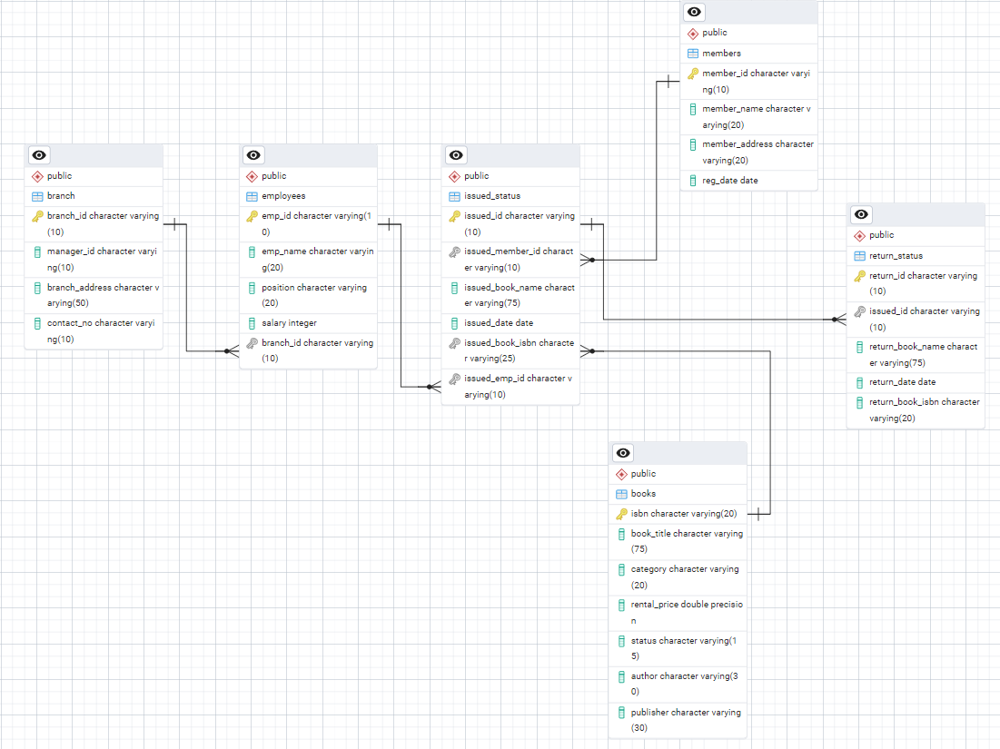

# Library Management System using SQL

## Project Overview

**Project Title**: Library Management System  
**Level**: Intermediate  
**Database**: `library_db`

This project demonstrates the implementation of a Library Management System using SQL. It includes creating and managing tables, performing CRUD operations, and executing SQL queries. The goal is to showcase skills in database design, manipulation, and querying.


## Objectives

1. **Set up the Library Management System Database**: Create and populate the database with tables for branches, employees, members, books, issued status, and return status.
2. **CRUD Operations**: Perform Create, Read, Update, and Delete operations on the data.
3. **CTAS (Create Table As Select)**: Utilize CTAS to create new tables based on query results.

## Project Structure

### 1. Database Setup


- **Database Creation**: Created a database named `library_db`.
- **Table Creation**: Created tables for branches, employees, members, books, issued status, and return status. Each table includes relevant columns and relationships.

```sql
CREATE DATABASE library_db;

CREATE TABLE branch(
branch_id VARCHAR(10) PRIMARY KEY,
manager_id VARCHAR(10),
branch_address VARCHAR(50),
contact_no VARCHAR(10)
);
ALTER TABLE branch
ALTER COLUMN contact_no TYPE VARCHAR(20);


-- Create table "Employee"
CREATE TABLE employees
(
            emp_id VARCHAR(10) PRIMARY KEY,
            emp_name VARCHAR(30),
            position VARCHAR(30),
            salary DECIMAL(10,2),
            branch_id VARCHAR(10),

	-- Foreign Key Constraints
	CONSTRAINT fk_branch FOREIGN KEY (branch_id) REFERENCES branch(branch_id)
);


-- Create table "Members"
CREATE TABLE members
(
            member_id VARCHAR(10) PRIMARY KEY,
            member_name VARCHAR(30),
            member_address VARCHAR(30),
            reg_date DATE
);


-- Create table "Books"
CREATE TABLE books
(
            isbn VARCHAR(50) PRIMARY KEY,
            book_title VARCHAR(80),
            category VARCHAR(30),
            rental_price DECIMAL(10,2),
            status VARCHAR(10),
            author VARCHAR(30),
            publisher VARCHAR(30)
);


-- Create table "IssueStatus"
CREATE TABLE issued_status
(
            issued_id VARCHAR(10) PRIMARY KEY,
            issued_member_id VARCHAR(30),
            issued_book_name VARCHAR(80),
            issued_date DATE,
            issued_book_isbn VARCHAR(50),
            issued_emp_id VARCHAR(10),

	-- Foreign Key Constraints
    	CONSTRAINT fk_members FOREIGN KEY (issued_member_id) REFERENCES members(member_id),
    	CONSTRAINT fk_books FOREIGN KEY (issued_book_isbn) REFERENCES books(ISBN),
    	CONSTRAINT fk_employees FOREIGN KEY (issued_emp_id) REFERENCES employees(emp_id) 
);


-- Create table "ReturnStatus"
DROP TABLE IF EXISTS return_status;
CREATE TABLE return_status
(
            return_id VARCHAR(10) PRIMARY KEY,
            issued_id VARCHAR(30),
            return_book_name VARCHAR(80),
            return_date DATE,
            return_book_isbn VARCHAR(50),

	-- Foreign Key Constraints
	CONSTRAINT fk_issued_status FOREIGN KEY (issued_id) REFERENCES issued_status(issued_id)
);

```

### 2. CRUD Operations

- **Create**: Inserted sample records into the `books` table.
- **Read**: Retrieved and displayed data from various tables.
- **Update**: Updated records in the `employees` table.
- **Delete**: Removed records from the `members` table as needed.

**Task 1. Create a New Book Record**
-- "978-1-60129-456-2', 'To Kill a Mockingbird', 'Classic', 6.00, 'yes', 'Harper Lee', 'J.B. Lippincott & Co.')"

```sql
INSERT INTO books(isbn, book_title, category, rental_price, status, author, publisher)
VALUES('978-1-60129-456-2', 'To Kill a Mockingbird', 'Classic', 6.00, 'yes', 'Harper Lee', 'J.B. Lippincott & Co.');
SELECT * FROM books;
```
**Task 2: Update an Existing Member's Address**

```sql
UPDATE members
SET member_address = '125 Oak St'
WHERE member_id = 'C103';
```

**Task 3: Delete a Record from the Issued Status Table**
-- Objective: Delete the record with issued_id = 'IS121' from the issued_status table.

```sql
DELETE FROM issued_status
WHERE   issued_id =   'IS121';
```

**Task 4: Retrieve All Books Issued by a Specific Employee**
-- Objective: Select all books issued by the employee with emp_id = 'E101'.
```sql
SELECT * FROM issued_status
WHERE issued_emp_id = 'E101'
```


**Task 5: List Members Who Have Issued More Than One Book**
-- Objective: Use GROUP BY to find members who have issued more than one book.

```sql
SELECT
    issued_emp_id,
    COUNT(*) AS book_issued
FROM issued_status
GROUP BY issued_emp_id
HAVING COUNT(issued_id) > 1
```

### 3. CTAS (Create Table As Select)

- **Task 6: Create Summary Tables**: Used CTAS to generate new tables based on query results - each book and total book_issued_cnt**

```sql
CREATE TABLE book_issued_summary AS
SELECT issued_book_name, COUNT(*) AS issue_count
FROM issued_status
GROUP BY issued_book_name;
```


### 4. Data Analysis & Findings

The following SQL queries were used to address specific questions:

Task 7. **Retrieve All Books in a Specific Category**:

```sql
SELECT * FROM books
WHERE category = 'Classic';
```

8. **Task 8: Find Total Rental Income by Category**:

```sql
SELECT 
    b.category,
    SUM(rental_price) AS total_rental_income
FROM issued_status AS ist
JOIN books AS b ON b.isbn = ist.issued_book_isbn
GROUP BY b.category;
```

9. **List Members Who Registered in the Last 180 Days**:
```sql
SELECT * FROM members
WHERE reg_date >= CURRENT_DATE - INTERVAL '180 days';
```

10. **List Employees with Their Branch Manager's Name and their branch details**:

```sql
SELECT 
   	e.emp_id,
   	e.emp_name AS employee_name,
	e.position,
	e.salary,
   	b.branch_id,
	b.manager_id,
    	m.emp_name AS manager
FROM employees e
JOIN branch b ON e.branch_id = b.branch_id
LEFT JOIN employees m ON b.manager_id = m.emp_id;
```

Task 11. **Create a Table of Books with Rental Price Above a Certain Threshold**:
```sql
CREATE TABLE premium_books AS
SELECT * FROM books
WHERE rental_price > 7;
```

Task 12: **Retrieve the List of Books Not Yet Returned**
```sql
SELECT 
   DISTINCT ist.issued_book_name
FROM issued_status AS ist
LEFT JOIN return_status AS rst
    ON ist.issued_id = rst.issued_id
WHERE rst.issued_id IS NULL;
```

## Reports

- **Database Schema**: Detailed table structures and relationships.
- **Data Analysis**: Insights into book categories, employee salaries, member registration trends, and issued books.
- **Summary Reports**: Aggregated data on high-demand books and employee performance.
